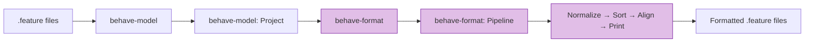
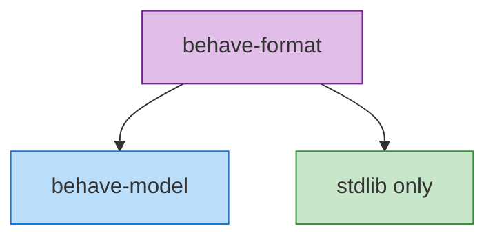

# Architecture

## Design philosophy

behave-format is intentionally minimal — it does one thing and does it well:

- **No parsing** — relies entirely on [behave-model](https://github.com/MathiasPaulenko/behave-model)
- **No linting** — that's [behave-lint](https://github.com/MathiasPaulenko/behave-lint)'s job
- **No validation** — that's behave-model's job
- **Only formatting** — deterministic transformation of model → text

This separation of concerns keeps each tool focused and composable.

## High-level architecture



## Module structure

```text
behave_format/
├── __init__.py              # Public API exports
├── __main__.py              # python -m behave_format entry point
├── config/
│   └── settings.py          # Settings dataclass + pyproject.toml loader
├── pipeline/
│   ├── normalize.py         # Whitespace, indentation, tag normalization
│   ├── sort.py              # Sort tags, features, scenarios
│   ├── align.py             # Table alignment, trailing whitespace
│   ├── rules.py             # Formatting rules registry & apply_rules
│   └── formatter.py         # Main orchestrator (format_project, render_project)
├── printer/
│   ├── feature_printer.py   # Feature → .feature text
│   ├── scenario_printer.py  # Background/Scenario/ScenarioOutline → text
│   ├── step_printer.py      # Step with DocString & Table → text
│   ├── table_printer.py     # Table with aligned columns → text
│   └── tag_printer.py       # Tag list → space-separated string
└── cli/
    └── main.py              # CLI entry point (argparse)
```

## Module responsibilities

### `config/`

Holds the `Settings` dataclass — an immutable configuration object. Handles
loading from `pyproject.toml`, creating from dicts, and immutable overrides
via `with_indent()`.

### `pipeline/`

The core formatting engine. Each stage is a standalone function that takes a
`Project` and `Settings`:

| Module | Stage | What it does |
|--------|-------|-------------|
| `normalize.py` | 1. Normalize | Clean whitespace, standardize indentation, normalize tags |
| `sort.py` | 2. Sort | Sort tags/features/scenarios per Settings |
| `align.py` | 3. Align | Align table columns, pad cells, remove trailing whitespace |
| `rules.py` | — | Rule type definition and `apply_rules` runner |
| `formatter.py` | — | Orchestrator: `format_project`, `render_project`, `format_feature`, `render_feature` |

### `printer/`

Converts `behave-model` objects into formatted Gherkin text. Each printer handles
one model element:

| Module | Handles |
|--------|---------|
| `feature_printer.py` | Complete `.feature` file output |
| `scenario_printer.py` | `Background`, `Scenario`, `ScenarioOutline` |
| `step_printer.py` | `Step` with `DocString` and `Table` |
| `table_printer.py` | `Table` with aligned columns |
| `tag_printer.py` | `Tag` list → space-separated string |

### `cli/`

The command-line interface. Uses `argparse` and supports:

- File and directory paths (recursive `.feature` discovery)
- `--check`, `--diff`, `--stdin`, `--indent`, `--config`, `--quiet` flags
- Exit codes: 0 (success), 1 (formatting needed), 2 (error)

## Data flow

```text
.feature files
      │
      ▼
behave-model (parse + validate)
      │
      ▼
behave-model.Project (domain model)
      │
      ▼
behave-format: normalize_project()
      │  → clean whitespace, indentation, tags
      │
      ▼
behave-format: sort_project()
      │  → sort tags, features, scenarios
      │
      ▼
behave-format: align_project()
      │  → align tables, pad cells
      │
      ▼
behave-format: print_feature()
      │  → model → .feature text
      │
      ▼
formatted .feature files
```

## Dependencies



behave-format has exactly **one runtime dependency**: [behave-model](https://github.com/MathiasPaulenko/behave-model).
Everything else uses the Python standard library.

## Design principles

1. **Single responsibility** — each module does one thing
2. **Immutability** — `Settings` is frozen, pipeline stages don't create new objects
3. **Composition over inheritance** — rules are callables, not classes
4. **Determinism** — same input always produces same output
5. **Safety** — never change semantics, only formatting
