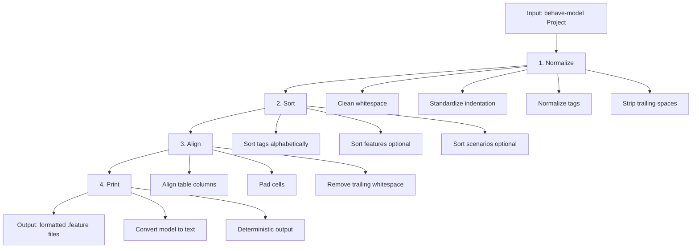

# Formatting Pipeline

The formatting process follows a strict 4-stage pipeline. Each stage operates on
the `behave-model` `Project` in place, transforming it step by step into a
canonical, formatted state.

## Overview



## Stage 1: Normalize

Cleans and standardizes the model's whitespace and structure.

**What it does:**

- Strips trailing whitespace from all text fields (step text, comments, descriptions)
- Standardizes indentation to the configured `indent` value
- Normalizes tag names (ensures `@` prefix)
- Strips leading/trailing whitespace from table cells
- Removes empty lines that have only whitespace
- Ensures `# language:` directives are preserved

**What it does NOT do:**

- Change any text content (only surrounding whitespace)
- Remove or add comments
- Modify DocString content

```python
from behave_format.pipeline.normalize import normalize_project

normalize_project(project, settings)
```

## Stage 2: Sort

Orders elements within the project according to `Settings`.

**What it does:**

- Tags sorted alphabetically (default: `sort_tags = true`)
- Features sorted by name (optional: `sort_features = false`)
- Scenarios sorted by name (optional: `sort_scenarios = false`)

**What it does NOT do:**

- Change any text content
- Remove or add elements

```python
from behave_format.pipeline.sort import sort_project

sort_project(project, settings)
```

## Stage 3: Align

Ensures tables are rectangular and consistently padded.

**What it does:**

- Computes column widths from the widest cell in each column
- Pads all cells to match their column width
- Ensures all rows have the same number of columns
- Removes trailing whitespace from padded cells

**What it does NOT do:**

- Change cell values (only padding/alignment)
- Add or remove columns

```python
from behave_format.pipeline.align import align_project

align_project(project, settings)
```

## Stage 4: Print

Converts the `behave-model` objects into formatted Gherkin text.

**What it does:**

- Converts `Feature`, `Scenario`, `Step`, `Table`, `Tag` objects to text
- Applies correct indentation at each level
- Inserts blank lines between blocks according to formatting rules
- Produces deterministic output (same model → same text, always)

**Printers:**

| Printer | Handles |
|---------|---------|
| `feature_printer` | Full `.feature` file (tags, description, background, scenarios, rules) |
| `scenario_printer` | `Background`, `Scenario`, `ScenarioOutline` blocks |
| `step_printer` | `Step` with `DocString` and `Table` |
| `table_printer` | `Table` with aligned columns |
| `tag_printer` | `Tag` list as space-separated string |

```python
from behave_format.printer.feature_printer import print_feature

text = print_feature(feature, indent=2)
```

## Idempotency

A critical requirement of the formatter:

```text
format(format(project)) == format(project)
```

Running the formatter twice always produces identical output. This is guaranteed by:

1. **Normalize** produces a canonical state — there's no "more normalized" state
2. **Sort** is deterministic — alphabetical sort is stable
3. **Align** is idempotent — already-aligned tables are not changed
4. **Print** is deterministic — same model always produces same text

### Verifying idempotency

```python
from behave_model import load_project
from behave_format import format_project, render_project, Settings

project = load_project("features/")

# First format
format_project(project, Settings())
text1 = render_project(project, Settings())

# Second format (should produce identical output)
format_project(project, Settings())
text2 = render_project(project, Settings())

assert text1 == text2  # Always passes
```

## Rule system

The pipeline uses a simple rule system. Each rule is a callable that transforms
a `Project` with `Settings`:

```python
from behave_format.pipeline.rules import Rule, apply_rules

# A rule is just a callable
def my_rule(project, settings):
    # Transform project...
    return project

rules: list[Rule] = [normalize_project, sort_project, align_project]
apply_rules(project, rules, settings)
```

This makes the pipeline extensible — you can add custom rules without modifying
the core formatter.
